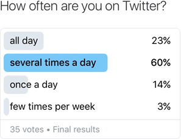
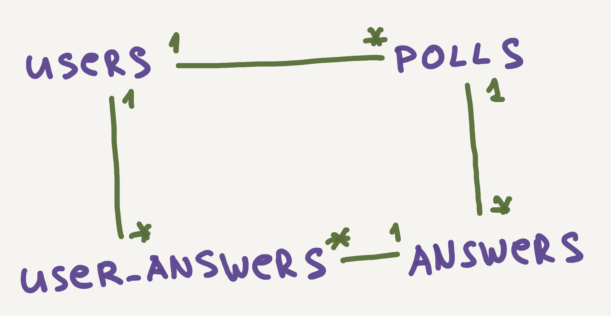

# Postgres cli

Установите postgres, затем попробуйте выполнить несколько комманд в коммандной строке, чтобы понять как работать с PostgreSQL через CLI (Command line interface). 
Затем переходите к выполнению релизов. Все команды, которые вы будете выполнять в ходе работы - записывайте в отдельный файл `commands.sql`, который лежит в корне проекта.

## Введение
С нами связалась компания, которая позволяет пользователям создавать голосования, состоящие из одного вопроса, а также отвечать на них. Эта компания хотела бы, чтобы мы создали для нее базу данных, способную поддержать их бизнес. Ниже приведено описание того, как происходит работа с голосованиями.

### Описание голосования
Когда пользователи создают новое голосование, то в его рамках они могут задать один вопрос. Они также предоставляют список вариантов ответа, из которых респонденты выбирают наиболее, с их точки зрения, подходящий. Когда пользователи соглашаются принять участие в голосовании, то им предоставляется тот самый вопрос  и список вариантов ответа на него. Участники голосования выбирают правильный, по их мнению, вариант ответа. Создатели голосования могут затем просмотреть полученные в результате голосования ответы.

На Рисунке 1 мы видим голосование, которое представляет собой вопрос «Как часто вы заходите в Твиттер?» и предлагается четыре варианта ответа: *в течение всего дня*, *несколько раз в день*, *один раз в день* и *несколько раз в неделю*. Пользователи, участвующие в голосовании, выбирают один из предоставленных вариантов.

*Рисунок 1*. Пример голосования от Twitter.

## Release 0. Спроектируйте БД.
Для начала представьте, что вам нужно разработать приложение для голосования. Схематично нарисуйте на бумаге все веб-страницы, которые будут в вашем приложении. Например: страница регистрации, профиль, главная страница и т.д. Что будет отображаться на каждой из ваших страниц? При проектировании БД надо ориентироваться исключительно на интерфейс приложения (сейчас в качестве интерфейса выступают ваши веб-странички нарисованные на бумаге). В идеале, каждой страничке приложения - соответствует сущность из БД. Надо придерживаться такой стратегии. Однако, старайтесь избегать избыточности данных, в мире SQL это самая большая проблема.

*Рисунок 2*. Пример схемы БД.

Необходимо делать это через утилиту psql. В редких случаях можно использовать GUI.
Создайте все нужные таблицы с необходимыми столбцами для вашего приложения голосований, не забудьте про "связи" между таблицами.

Можете ли вы ответить на нижеприведенные вопросы по вашей схеме?

- Какие голосования создал пользователь?
- На какие голосования отвечал пользователь?
- Какие варианты ответов выбирал пользователь?
- Какой пользователь создал голосование?
- Какие пользователи приняли участие в голосовании?
- Каковы возможные варианты ответа на этот вопрос?
- Какие варианты ответов на этот вопрос выбирали респонденты?
- Для какого голосованиа был выбран этот вариант ответа?
- Какие пользователи выбрали этот вариант ответа?

## Release 1.
Наполните вашу БД небольшим объемом данных через psql. В каждой таблице должны быть минимум 3-4 записи.

## Release 2.
Выведите в командную строку:
1. Все голосования
2. Всех пользователей
3. Ответы определенного пользователя
4. Всех пользователей вместе с их ответами

## Release 3.
Поработаем над редактированием данных:
1. Измените имя у одного пользователя
2. Смените автора у одного из голосований.
3. Удалите одно любое голосование.
4. Можете очистить базу данных, если она вам более не нужна.

