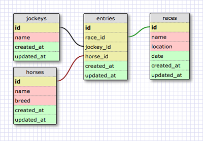

# Скачки!

## Введение

*Рисунок 1*. Схема для задачи (Как бы она выглядела для SQL - базы данных).

Представим, что мы создаем полноценное приложение, которое позволяет планировать расписание скачек. В этом приложении пользователи могут зарегистрироваться как жокеи, вписать свою лошадь, выбрать гонку, в которой хотят принять участие. На Рисунке 1 показано как бы выглядела схема в реляционной базе данных.

БД должна позволить нам ответить на следующие вопросы:

*Для лошади ...*

1. В каких гонках лошадь принимала участие?
2. Какие жокеи участвовали в заезде на этой лошади?

*Для жокея ...*

1. В каких гонках участвовал жокей?
2. На каких лошадях ездил жокей?

*Для гонки ...*

1. Какие жокеи принимали участие в гонке?
2. Какие лошади принимали участие в гонке?

## Releases

### Release 0 (Sequelize RAW Queries)
Создайте файл с проектом, подключите Sequelize и настройте соединение с базой данных.  
Напишите все необходимые команды DDL для создания таблиц. Наполните вашу БД данными. Далее пройдите по всем вышеприведенным вопросам и составьте по каждому запрос к БД. Эти запросы должны выдавать соответствующие ответы. Таким образом вы сможете проверить себя и исправить вашу БД, если в ней обнаружатся ошибки.

### Release 1 (Sequelize Models)

Теперь напишите модели, используя Sequelize-cli. Далее выполните то же самое, что делали в Релизе 0: 
- Наполните вашу БД данными, можете использовать для этого [faker](https://www.npmjs.com/package/faker). 
- Пройдите по всем вышеприведенным вопросам и составьте по каждому запрос к БД.
