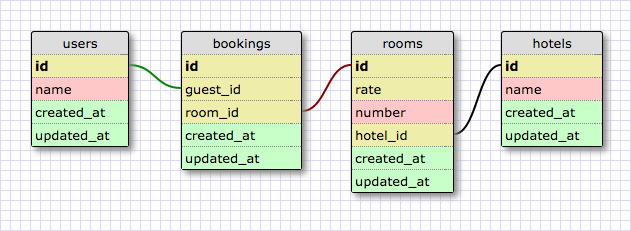

# Отели

## Введение
В этой задаче вы научитесь работать с моделями отношениями. Это классический подход реляционных БД, в котором связи имеют не меньшую ценность чам сама информация.  Мы будем учиться составлять отношения между моделями, делать ссылки на другие модели и писать методы.

Перед тем как приступить к выполнению релизов изучи эти темы в документации.

- [model]
- [sequelize cli]
- [Associations]

*Рисунок 1*. Дизайн схемы для этой задачи

Мы сосредоточимся на написании связей в этой задаче, но давайте представим, что мы создаем полноценное приложение, которое позволяет забронировать номера в отеле. Отели регистрируют свои номера на основе нашего бронирования, и после этого пользователи могут забронировать номера в отелях. Мы не будем беспокоиться о датах бронирования и других деталях, которые важны в реальном мире. Мы просто хотим сосредоточиться на том, как мы можем связывать наши модели друг с другом.

Когда наши связи будут написаны, то мы сможем ответить на следующие вопросы.

*Для пользователя ...*

1. Какие заказы были сделаны пользователем?
2. Какие номера забронировал пользователь?
3. В каких отелях пользователь забронировал номер?

*Для отеля ...*

1. Какие номера имеются в отеле?
2. Какие заказы были сделаны в отеле?
3. Какие гости заказали номера в отеле?

*Для комнаты ...*

1. В каком отеле находится номер?
2. Какое бронирование этого номера было сделано?

*Для бронирования ...*

1. Для какого гостя было сделано это бронирование?
2. Какой номер был забронирован?
3. В каком отеле было сделано бронирование?

## Releases

### Release 0: Создайте модели
Вам предстоит создать все необходимые модели с помощью Sequelize CLI. Посмотрите на картинку, определите какие сущности у вас есть и создайте модель для каждой из них.

В этой задаче вам помогут следующие страницы документации:
- [model]
- [sequelize cli]

### Release 1: Организуйте связи
Следующим шагом нужно указать в моделях ссылки на другие модели. Чтобы понять, что нужно сделать, внимательно посмотрите на дизайн схемы, на ней указаны связи каждой модели. 
Если вы можете ответить на все поставленные вопросы, то это означает, что наши связи построены правильно.

В этой задаче вам помогут следующие страницы документации:
- [Associations]
- [Model Querying]

<!--
### Release 1: Так ли нужны ссылки?
Подумайте, как можно реорганизовать структуру вашей БД. Постарайтесь добиться того, чтобы для ответа на большинство вышеприведенных вопросов нужно было взаимодействовать лишь с одной коллекцией. Вам нужно денормализовать вашу БД. Такой подход наиболее близок для документоориентированных БД. 
-->

## Заключение

В этой задаче нашей целью было написание связей в моделях и использование методов объектов, которые формируют запросы к базе данных. После завершения задания вы должны понимать, как формируются связи, что такое модель и зачем нужен [Foreign Key](https://postgrespro.ru/docs/postgresql/12/tutorial-fk), а также когда именно он нужен, и в каких случаях можно обойтись без него.

[model]: https://sequelize.org/master/manual/model-querying-basics.html
[sequelize cli]: https://sequelize.org/master/manual/migrations.html
[Associations]: https://sequelize.org/master/manual/assocs.html
[Model Querying]: https://sequelize.org/master/manual/model-querying-basics.html

