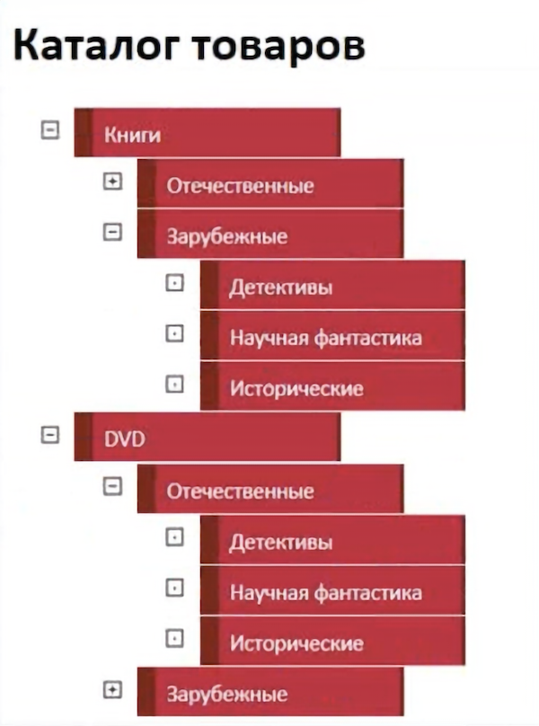

## Каталог товаров

Ты покупаешь товары в интернет-магазине? В интернет-магазинах слева часто можно встретить раскрывающийся каталог товаров. В основе каталога находятся разделы с товарами, которые подразделяются на более узкие группы. И наконец, если группы товаров не делятся на еще более мелкие группы, мы можем наткнуться на определенный товар и пройти по ссылке на страницу с товаром.

Сегодня тебе предстоит создать каталог товаров.
Пример каталога:

### Release 0

Сверстай каталог товаров при помощи списков и вложенных списков. Уровень вложенности может быть любым. Ориентируйся на картинку выше, но можешь сделать собственные стили. Для наглядности, можно открыть любой интернет-магазин и взять оттуда несколько категорий товаров.

### Release 1

Теперь при помощи CSS `сверни` каталог, оставив видимыми только основные разделы товаров (верхний уровень списка)

### Release 2

Приправь каталог JavaScript-кодом. При нажатии на элемент списка `<li>`, если у него имеется дочерний элемент (вложенный список) - разверни список, иначе, если группу товаров больше нельзя развернуть, показывай конечный товар (ссылку на товар, по которой можно перейти на страницу с товаром).
