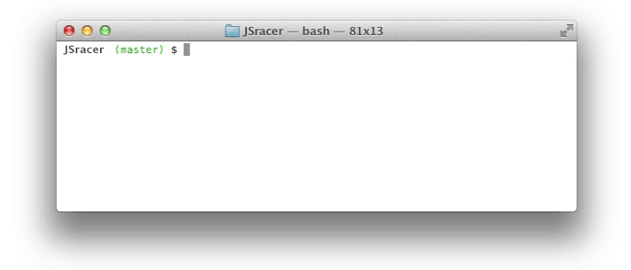

## JS Racer

Врум врум! Давай поиграем! Напиши простую игру под названием JS Racer. Правила просты: брось кубик и двигайся вперед. Нет никакой стратегии или принятия решений, просто надейся на удачу и [Math.random()](https://developer.mozilla.org/en-US/docs/Web/JavaScript/Reference/Global_Objects/Math/random)!

Игра - это гонка между двумя игроками. Оба игрока начинают игру в начале трека, бок о бок. Игроки по очереди бросают кубик и продвигаются по дорожке **на одну позицию**, в зависимости от чисел на кубике, и делают это до тех пор, пока один из них не достигнет конца трека и не выиграет поединок.

Однако, в процессе создания нашей игры, могут возникнуть некоторые трудности: 
1. Управление состоянием игры (например, отслеживание позиций игроков)
2. Преобразование данных из одной структуры в другую (например, преобразование игровых данных в напечатанную доску).

Ниже приведена версия консольной игры. Если у тебя есть желание - можешь сделать ее с веб-интерфейсом, чтобы играть в браузере.

### Release 0. Сделать минималистичную версию игры

Тебе необходимо создать рабочую версию *JS Racer*. Что это значит? Она должна запускаться, в ней должны каким-то образом передвигаться 2 машинки. Когда одна из них достигает финиша - об этом сообщается пользователю, а затем игра заканчивается.
На самом деле задание не такое простое как кажется! Рекомендуем очень внимательно изучить функции `setTimeout()` и `setInterval()`. Эти 2 функции работают достаточно интересно. Тут ты плавно начнешь свое знакомство с понятием `Асинхронность`.

### Release 1. Нужно больше функций *(необязательно)*

Что бы сделало эту игру более увлекательной? Теперь, когда базовая версия игры работает, давай посмотрим, не можем ли мы ее немного улучшить? Ниже приведены некоторые предложения по улучшению, но ты можешь добавлять и свои собственные функции.

- Зачем ограничивать игру двумя игроками, всегда называемыми `a` и `b`? Позволь любому количеству игроков зарегистрироваться на гонку и выбрать свои собственные символы для имен.
- Вместо использования однобуквенных символов для каждого игрока, ты можешь использовать искусство [ASCII](https://sites.google.com/site/asciisandbox/art/vehicles), [конвертацию слов](https://github.com/miketierney/artii)).
- Ты можешь сделать игру более похожей на «Chutes and Ladders» («Горки и лестницы»), предоставляя игрокам неожиданные бонусы в виде ускорения машины, случайного включения заднего хода, аварий, заставляющих пропускать ходы.
- Можно уменьшить долю случайности в игре, давая игрокам больше контроля над тем, как они перемещаются по всем направлениям.
