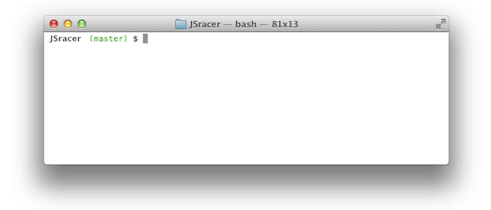

## JS OOP Racer

Врум врум! Давай поиграем! Возможно ты уже сталкивался с заданием [JS Racer](core-algorithm-interval-racer). Теперь ты знаешь ООП, поэтому можешь сделать ещё более крутые гоночки! Правила просты: брось кубик и двигайся вперёд!

JS Racer - это гонка между двумя (или более!) игроками. Оба игрока начинают игру в начале трека, бок о бок. Игроки по очереди бросают игральные кости и продвигаются по дорожке **на одну позицию**. В каждом раунде двигается только тот, у кого выпало наибольшее значение на кубиках. Игра продолжается до тех пор, пока один из гонщиков не достигнет конца трека, чем выиграет поединок.

Однако в процессе создания игры могут возникнуть некоторые трудности:

1. Управление состоянием игры (например, отслеживание позиций игроков)
2. Преобразование данных из одной структуры в другую (например, преобразование игровых данных в напечатанную доску).
3. Проектирование игры в соответствии с принципами ООП.

Ниже приведена консольная версия игры. Если у тебя есть желание - можешь сделать ее с веб-интерфейсом, чтобы можно было играть в браузере.

### Release 0. Спроектируй

Подумай какие тебе понадобятся классы. В `runner.js` уже есть некоторые заготовки, однако ты можешь писать по-своему. Классы желательно разносить по разным файлам. Каждому классу - собственный файл.
Подумай над тем, как классы будут взаимодействовать. Заполни конструкторы, добавь необходимые методы.

### Release 1. Начало

Ты создал свою заготовку. Пора переходить к самому важному.

Тебе необходимо создать рабочую версию *JS Racer*. В ней должны каким-то образом передвигаться 2 машинки. Когда одна из них достигает финиша - об этом сообщается пользователю, а затем игра заканчивается.

Рекомендуем очень внимательно изучить функции `setTimeout()` и `setInterval()`. Эти 2 функции (или одна из них) могут пригодиться при выполнении задания.

### Release 2. Нужно больше функций

Готово? Игра запускается, код соответствует принципам ООП и стилю кода по `airbnb`, подключен `eslint`? Что сделало бы эту игру более увлекательной? Теперь, когда базовая версия игры работает, давай посмотрим, что можно улучшить? Ниже приведены некоторые предложения по улучшению, но ты можешь добавлять и свои собственные функции.

- Зачем ограничивать игру двумя игроками, всегда называемыми `a` и `b`? Позволь любому количеству игроков зарегистрироваться на гонку и выбрать свои собственные символы для имён.
- Вместо использования однобуквенных символов для каждого игрока, ты можешь использовать искусство [ASCII](https://sites.google.com/site/asciisandbox/art/vehicles), [конвертацию слов](https://github.com/miketierney/artii)).
- Ты можешь сделать игру более похожей на «Chutes and Ladders» («Горки и лестницы»), предоставляя игрокам неожиданные бонусы в виде ускорения машины, случайного включения заднего хода, аварий, заставляющих пропускать ходы.
- Можно уменьшить долю случайности в игре, давая игрокам больше контроля над тем, как они перемещаются по всем направлениям.
