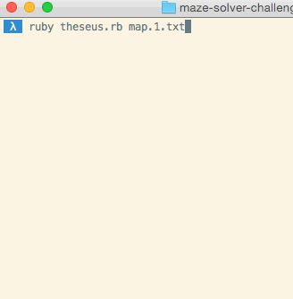

# Лабиринт

> "Таким образом, герой встретил Минотавра в мрачных глубинах Лабиринта и не был напуган". -Тесей и Минотавр

В этой задаче вам нужно будет создать программу, которая определяет, разрешим ли лабиринт или нет. Шаг за шагом, и Вы создадите программу, чтобы:

  * Читать файл, содержащий Лабиринт
  * Представлять лабиринт в коде
  * Использовать стратегию, чтобы определить, разрешим ли Лабиринт

**Требуются тесты**. Эта задача может легко завести в тупик, если вы не будете тщательно тестировать даже самые основные методы. Например, простая ошибка, подобная смешению x и y, может иметь некоторые запутанные и неочевидные последствия. Если Вы не знаете, как проверить что-то, обратитесь за помощью.   
Для установки зависимостей проекта - ```npm install```   
Для запуска тестов - ```npm test```

## Чтение лабиринта

Ваш лабиринт будет определен в текстовом файле, который выглядит так:

```
o#........
.#####.##.
.......##.
######.#*.
.......###
```
 * `#` означает стену
 * `.` означает открытое пространство
 * `o` означает место старта
 * `*` означает Вашу конечную цель


Вам предоставлен метод, называемый `readMaze`. Он берет файл и возвращает двумерный массив, представляющий лабиринт. См. пример в файле спецификации.

## Release 1. Упрощенные задачи

Ваша задача - написать **рекурсивный** алгоритм, который определяет, проходим ли лабиринт. Ваш метод `isSolvable()` должен выдавать`true`, если финиш (`*`) достигаем из начала (`o`). Он должен выдавать `false`, если невозможно достичь конца (нет пути). Вам не нужно возвращать путь.

Прежде чем начать, поработайте с вашей парой, чтобы подумать о том, на какие вопросы вам нужно ответить. Вот несколько возможный вопросов:

 * Где начальная позиция?
 * Открыта ли конкретная позиция (x, y)? Это стена? Это цель?
 * Если я смотрю на определенную позицию, то что ее окружает?
 * Как я могу узнать, какие клетки вокруг определенной позиции - открытое пространство?

Для каждого метода, который вы пишете, напишите тест.

Мы будем использовать методы, которые мы пишем в этом релизе, в следующей задаче.

## Release 2. Исследование лабиринта

Теперь, когда мы написали методы, мы можем их использовать, чтобы написать наш рекурсивный алгоритм.

Напомним, вот наша задача:

> Задача - написать рекурсивный алгоритм, определяющий, можно ли пройти лабиринт или нет. Ваш метод `isSolvable`, Он должен выдавать` true`, если финиш (`*`) достижим из начальной позиции (`o`). Он должен выдавать `false`, если невозможно достичь конца (нет пути). Вам не нужно возвращать путь.


Подсказка: ваш рекурсивный алгоритм должен будет исследовать ячейки до тех пор, пока не найдет финиш, или не определит, что финиш недостижим.
Убедитесь, что вы тестируете лабиринты(задачи) разных типов. Некоторые примеры содержатся в этом репозитории.

## Stretch 1. Итеративный

Придумайте итеративное решение, сравните его с вашим рекурсивным решением.




Можете ли вы создать итеративные решения, имитирующие оба способа решения?

## Stretch 2 Более сложные лабиринты и открытая местность

Запустите свою программу, подавая на вход более сложные лабиринты. 

```
...#.....#
...#.#.#.#
...#.#.#.#
.#...#.#*#
.#########
........o.
####.#####
..........
.###.####.
...#......
```


```
.................
........#........
........#.*......
........#........
........#........
........#........
........#........
........#........
........#........
.o......#........
........#........
.................
```
