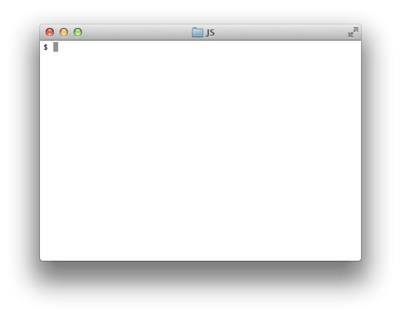
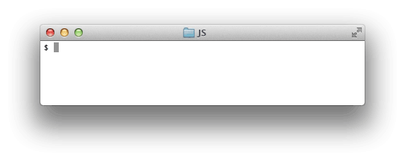

# Бистро Берни

## Введение
Поздравляем! Ваша трудная работа по моделированию апельсиновой рощи для фермера Федора окупилась! Федор порекомендовал вас своему другу Берни, владельцу популярного ресторана Bernie's Bistro.

Ранее Берни нанял другого программиста для того, чтобы построить компьютеризированную систему рецептов для ресторана, но программист не успел закончить работу. Поэтому теперь Берни нужно, чтобы кто-то закончил систему рецептов ресторана, и этим человеком становишься ты.

Другой программист должен уже был завершить работу над системой, и сроки поджимают, поэтому Берни хотел бы как можно скорее увидеть рабочую программу. Ваша задача - завершить программу, реализовать описанные ниже варианты ее использования. Будьте осторожны с разработкой программы – не увлекайтесь, ведь ваша единственная задача - решить *эти* проблемы, а не искать другие и заниматься их решением.

### Случаи использования системы рецептов



*Рисунок 1*. Пример использования, перечисление всех рецептов и отображение определенного рецепта.

Система рецептов должна поддерживать две возможности: (1) пользователи должны иметь возможность перечислять все рецепты в системе и (2) пользователи должны иметь возможность получить детали определенного рецепта. На Рисунке 1 показаны оба эти варианта использования, а также каким образом Берни хотел бы запустить приложение.

## Releases

### Release 0: Создание минимального жизнеспособного продукта
Основываясь на предоставленных js-файлах, попробуйте реализовать возможности использования программы, описанные во *Введении* и представленные на Рисунке 1. Помните, что Берни в ближайшее время хочет увидеть работающее приложение, поэтому нам нужно сосредоточиться исключительно на этих функциях и не тратить время на другие задачи.

Чтобы понимать, как работает программа в случае, когда пользователи хотят увидеть полный список рецептов, потребуйте от программы отображение чего-то наподобие Рисунка 2. Когда пользователи захотят увидеть детали какого-то конкретного рецепта, потребуйте от программы отображение чего-то наподобие Рисунка 3. До тех пор, пока не появится рецепт с существующим id, ошибка должна подниматься (см. Рис. 1).

```
$ node ​​recipe_system.js list
567 - Peanut Butter Coffee Brownie
938 - Bull Terrier Cake (for a puppy)
111 - Kale Burger
```

*Рисунок 2*. Список всех рецептов.


```
$ node ​​recipe_system.js display 111
Рецепт 111 - Kale Burger (бургер с капустой)
Kale Burger - одно из наших самых продаваемых блюд!
Оно сочетает в себе питательную ценность капусты и
вкус говядины!

Ингредиенты:
Капуста, говядина

Инструкции по приготовлению:
Разогрейте духовку до 500 градусов. Положите говядину. Подождите 10 минут.
Поместите туда немного капусты. Выньте приготовленную говядину и капусту. Положите их на булочку. Подавайте горячим!
```

*Рисунок 3*. Отображение определенного рецепта.

*Примечание:* Ваш главный приоритет - создание функционирующей системы рецептов. В файлах спецификаций есть несколько заглушек для тестов, которые обязательно должны быть завершены. Вы можете написать больше тестов, если хотите, но вы *не обязаны* делать это. Количество времени, которым вы располагаете, ограничено; помните о том, как вы его тратите. Рекомендуем сосредоточиться на реализации.

### Release 1: Рецепты, расположенные в алфавитном порядке (необязательно)
Поздравляем вас с выполнением этих задач! Этот Release является необязательным. Если вы хотите попробовать справиться с ним, то сначала не забудьте сделать коммит, чтобы при необходимости вы могли вернуться назад к *Release 0*.

В настоящее время система рецептов генерирует список рецептов вне зависимости от того, в каком порядке они располагаются сейчас. Берни хотел бы, чтобы рецепты были перечислены поименно в алфавитном порядке. (См. Рис. 4.)




*Рисунок 4*. Поименный список рецептов в алфавитном порядке.
